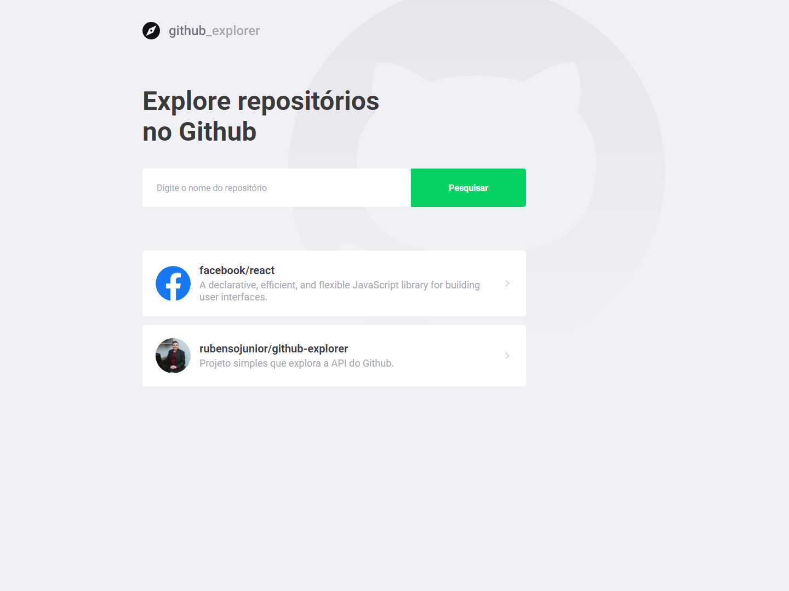
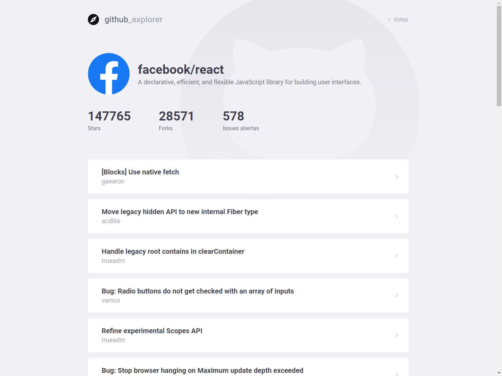

<h1 align="center">
 
Github Explorer
</h1>

This project was created to explore github api and its features

  

  
  

## API

This project connects with github API.

## Features

- Add github repository.
- Select github repository and see details, like stars, forks and issues.
- Select issue to go to issue page.

- ⚛️ **React Js** — A JavaScript library for building user interfaces

## Getting started

- Clone project > enter the project folder
- run `yarn`
- run `yarn start`

## License

This project is licensed under the MIT License - see the [LICENSE](https://opensource.org/licenses/MIT) page for details.

---

Created with passion by me 👨🏻‍💻
